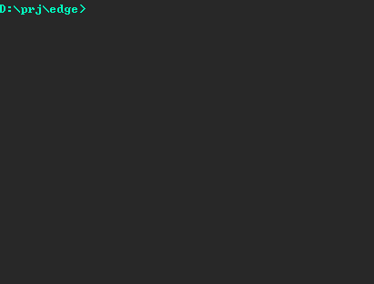
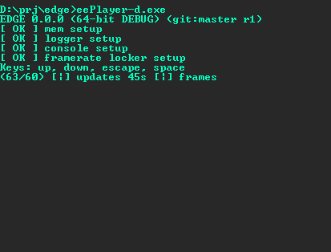

# ƎDGE 0x20

A tiny 3D game engine in C++, with C and Lua interfaces. Written in 32 days.

My very last attempt at creating a full game engine in a (jam) rush.

Hopefully functional in 32 days, maybe production ready in 32 weeks, and probably bugfree in 32 ~~months~~ years.

## Progress
- [x] [01 Project structure, makefiles, build system and main loop](doc/day01.md)
- [ ] [02 Data pipeline and data file formats (text: DEBUG) (binary: RELEASE)](doc/day02.md)
- [ ] [03 Message and serialization pipelines](doc/day03.md)
- [ ] 04 Server/client architecture.
- [ ] 05 Scripting and bindings.
- [ ] 06 Abstract input/HID interface: bindings, digital/analog inputs, filters, gestures, chords and combos.
- [ ] 07 Integrated CLI debugger and console.
- [ ] 08 Memory leak inspection.
- [ ] 09 Hot-reloading.
- [ ] 10 Basic 2D/2.5D/3D renderer.
- [ ] 11 Fonts and truetypes.
- [ ] 12 Cameras, arcballs and 3D navigation.
- [ ] 13 2D debug view, debug primitives, debug UI.
- [ ] 14 Easings.
- [ ] 15 Editor and timeline.
- [ ] 16 Scenegraph, LOD and culling architecture.
- [ ] 17 Procedural content integration.
- [ ] 18 Hashing and compression algorithms.
- [ ] 19 Spatial partioning and collisions.
- [ ] 20 Entity/Component/System architecture.
- [ ] 21 Runtime GameObject inspection.
- [ ] 22 Events, messages, triggers and regions.
- [ ] 23 World streaming and level loading: multithreaded with linear and double linear allocators.
- [ ] 24 Texture, audio, level image formats.
- [ ] 25 Particles.
- [ ] 26 Spritesheets, Spines, Billboards, Voxels, Static meshes.
- [ ] 27 Skeletal animation, H/FSM and AI.
- [ ] 28 Navmesh traversal and pathfinding.
- [ ] 29 Game UI.
- [ ] 30 L10N, i18N, subtitles and unicode.
- [ ] 31 2D/3D audio.
- [ ] 32 Full Motion Video and integrated cinematics.

## Screenshots
|Day 01|Day 02|
|:---:|:---:|
|||

|Day 03|Day 04|
|:---:|:---:|
|||
