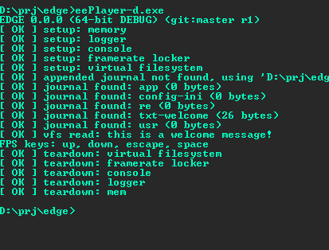

# ƎDGE 0x20

A tiny 3D game engine in C++, with C and Lua interfaces. Written in 32 random days.

My very last attempt at creating a full game engine in a (jam) rush.

Hopefully functional in 32 days, maybe production ready in 32 weeks, and probably bugfree in 32 ~~months~~ years.

## Progress
- [x] 01 [Project structure, build system, makefiles and game loop.](doc/day01.md)
- [x] 02 [Data pipeline and asset journaling.](doc/day02.md)
- [x] 03 [File formats, hashing, encryption and compression.](doc/day03.md)
- [ ] 04 Scripting, bindings and modules.
- [ ] 05 Server/client architecture.
- [ ] 06 Message pipeline and serialization.
- [ ] 07 Entity/Component/Systems.
- [ ] 08 Digital signals, buffering and polling.
- [ ] 09 Hot-reloading and watchdogs.
- [ ] 10 Timers, easings and interpolation.
- [ ] 11 HID interface: bindings, digital/analog inputs, filters, gestures, chords and combos.
- [ ] 12 Inspection: debugger, console, leaks, cvars, registers, callstack, gameobjects and profiling.
- [ ] 13 Volumes, collisions, regions and triggers.
- [ ] 14 Trees, scenegraphs and spatial partioning.
- [ ] 15 World streaming and level loading.
- [ ] 16 2D/2.5D/3D Renderer, FBOs, PostFX, FBOs.
- [ ] 17 Arcballs, cameras and 3D navigation.
- [ ] 18 LOD and frustum culling.
- [ ] 19 Fonts, truetypes, L10N, i18n, subtitles and unicode.
- [ ] 20 2D debug view, debug primitives, debug UI.
- [ ] 21 Procedural content, brushes, voxels, noise and CSG.
- [ ] 22 Static meshes, skyboxes, skydomes, cubemaps.
- [ ] 23 Spritesheets, GIFs, Billboards, 2D Decals, Backgrounds.
- [ ] 24 Particles, emitters, trails and paths.
- [ ] 25 Navpoints, navmesh traversal and pathfinding.
- [ ] 26 Spines, skeletal animation, blending, skinning, IK.
- [ ] 27 H/FSM, AI and blend zones.
- [ ] 28 Game flow and UI.
- [ ] 29 Dialogue, quests and inventory.
- [ ] 30 2D/3D audio.
- [ ] 31 Full Motion Video and integrated cinematics.
- [ ] 32 Editor, timeline and data tracks.

## Screenshots
|Day 01|Day 02|
|:---:|:---:|
|||

|Day 03|Day 04|
|:---:|:---:|
|||
